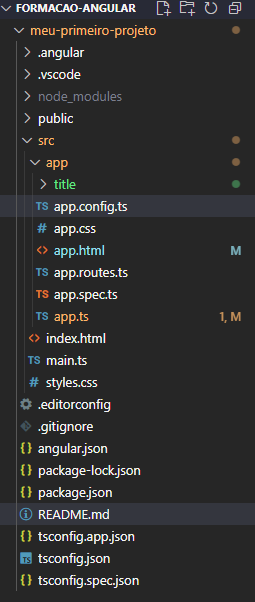

# Formação Angular
Angular é um framework javascript de código aberto que serve para criar SPA - Single Pages Applications, aplicações de única tela. Uma única pagina atende a necessidade do nosso projeto sem ter a necessidade de recarregar a pagina toda vez que alguma alteração é feita. Uma aplicação angular é baseada em componentes. Com os componenetes podemos encapsular regars da interface tornando a criação de aplicações algo mais simples. Inclusive um componente pode encapsular outros componentes.

**Componentes** → Divide a UI em partes independentes e reutilizavéis, trata cada parte da aplicação como um bloco isolado., livre de outras dependências externas. Eles aceitam entradas e retornam elementos que descrevem o que deve aparecer na tela.

Angular facilita a manutenção de layouts complexos e isola as responsabilidades de cada parte do seu código.


Estrutura de um projeto angular:



**Components**:

- component.css = Estilo do componente
- component.html = Estrutura html do componente
- component.ts = lógica do nosso componente

OBS:

**app.ts** - Nosso arquivo de entrada, carrega o módulo principal no module vai ser carregado o primeiro componente que é o app módule.


**Ciclo de vda**: No angular cada componente tem um ciclo de vida, vários estágios diferentes pelos quais ele passa. Existem 8 estágios diferentes 
no ciclo de vida do componente

Como um componente é uma classe TypeScript, cada componente deve ter um método
construtor

constructor(){}

O construtor da classe do componente é executado, primeiro, antes da execução de qualquer outro evento de ciclo de vida.

## Ciclo de Vida de Componentes no Angular

Os componentes do Angular possuem **métodos de ciclo de vida** que permitem reagir a eventos específicos durante sua criação, atualização e destruição.  
Abaixo está uma visão geral dos principais hooks e sua função.

| Ordem | Método | Descrição curta | Frequência de execução |
|:-----:|:--------|:----------------|:------------------------|
| 1️⃣ | **`ngOnChanges()`** | Chamado sempre que uma propriedade `@Input()` muda. | Múltiplas vezes (sempre que há mudança nos inputs) |
| 2️⃣ | **`ngOnInit()`** | Inicializa o componente — ideal para carregar dados iniciais ou chamadas de API. | Uma vez |
| 3️⃣ | **`ngDoCheck()`** | Detecta manualmente mudanças que o Angular não percebe automaticamente. | A cada ciclo de verificação |
| 4️⃣ | **`ngAfterContentInit()`** | Executado após o conteúdo externo (`<ng-content>`) ser projetado. | Uma vez |
| 5️⃣ | **`ngAfterContentChecked()`** | Chamado após cada verificação do conteúdo projetado. | Múltiplas vezes |
| 6️⃣ | **`ngAfterViewInit()`** | Executado após a inicialização da view e dos filhos (`@ViewChild`, `@ViewChildren`). | Uma vez |
| 7️⃣ | **`ngAfterViewChecked()`** | Chamado após cada verificação das views e elementos filhos. | Múltiplas vezes |
| 8️⃣ | **`ngOnDestroy()`** | Chamado antes do componente ser destruído — ideal para limpar recursos e cancelar subscriptions. | Uma vez |

---

### Exemplo básico de uso

```typescript
import { Component, OnInit, OnDestroy } from '@angular/core';

@Component({
  selector: 'app-example',
  templateUrl: './example.component.html'
})
export class ExampleComponent implements OnInit, OnDestroy {

  ngOnInit() {
    console.log('Componente inicializado');
  }

  ngOnDestroy() {
    console.log('Componente destruído');
  }
}
